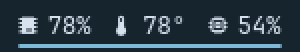
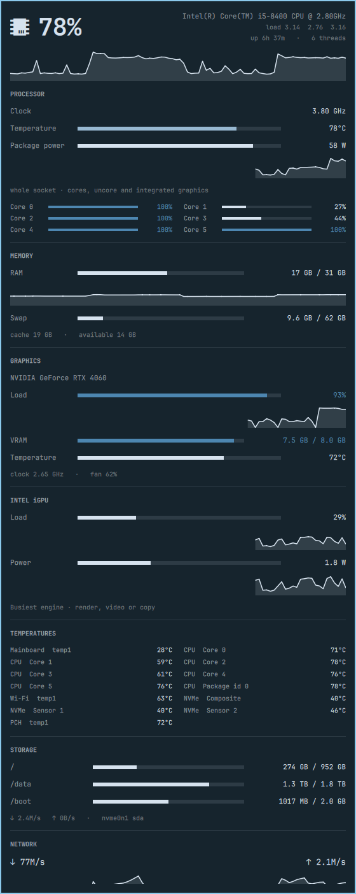

# Omastats

Live system statistics for the [Omarchy](https://omarchy.org) bar: a short
row of numbers in the bar, and the full read-out one click away.

The bar shows whichever metrics you pick — CPU, memory and network by
default. Clicking opens a panel with everything the plugin can measure:
per-core load, clock and temperature, memory and swap, GPU load, VRAM and
temperature, every hwmon sensor on the machine, filesystem usage and disk
throughput, per-interface network rates, and the eight processes using the
most CPU. Intel integrated graphics have their own load graph alongside the
discrete GPU. Power draw is read where the machine reports it: the socket's
own watts, the discrete card's, and the integrated graphics'. CPU, memory,
GPU, iGPU and network each carry a rolling history strip of the last ~90
samples.

<p align="center">
  
</p>

<p align="center">
  
</p>

## Requirements

Works on any Omarchy 4.x machine with no extra packages: CPU, memory,
temperatures, disks, network and processes come from `/proc`, `/sys`, `df`
and `ps`, all present on a stock install.

Optional, each enabling one more section:

| Dependency | Enables | Notes |
|---|---|---|
| `nvidia-smi` (NVIDIA driver) | NVIDIA GPU load, VRAM, temperature, power | First card only on multi-GPU machines |
| amdgpu kernel driver | AMD GPU load, VRAM, temperature, power | Read from sysfs, no package needed; the discrete card wins over an APU |
| `intel-gpu-tools` package | Intel iGPU graph, iGPU and package watts | See below for counter access |

Machines with none of these simply have no graphics section. Nothing is
downloaded or installed by the plugin itself.

### Intel iGPU access

`intel_gpu_top` reads the i915 performance counters, which an unprivileged
user cannot open while `kernel.perf_event_paranoid` is at its default of `2`.
Either lower that sysctl, or give the binary the `cap_perfmon` capability as
root (`setcap cap_perfmon=ep /usr/bin/intel_gpu_top`) — the latter lets any
local user read GPU performance counters, so decide whether that is
acceptable on your machine. Until then a detected iGPU shows an explanatory
message instead of a graph; unavailable readings are never displayed as 0%.
Restart the shell (`omarchy-restart-shell`) after installing the tool or
changing its permissions.

Intel's newer `xe` kernel driver (Lunar Lake and later) is only partly
supported by `intel_gpu_top`; on those machines the iGPU section may stay
empty.

The Intel iGPU graph shows the busiest engine's utilization (render, video,
copy, etc.), from 0–100%, with its own last 90 samples. It selects Intel's
integrated PCI device at `00:02.0`, independently of the NVIDIA/AMD sampler.

### Power draw

Three separate readings, each shown only where the machine actually reports
it:

| Reading | Where | Source |
|---|---|---|
| Package power | Panel, under PROCESSOR | `intel_gpu_top` |
| GPU power | Panel and bar (`gpuWatt`) | `nvidia-smi` / `amdgpu` sysfs |
| iGPU power | Panel, under INTEL iGPU | `intel_gpu_top` |

Package power is the *whole socket* — cores, uncore and the integrated
graphics together — not the CPU cores alone, which is why it is not
labelled as the CPU's draw. It is read from `intel_gpu_top`, so it needs
`intel-gpu-tools` and appears only while the panel is open. That is a
deliberate choice over the kernel's RAPL interface
(`/sys/class/powercap/.../energy_uj`): RAPL is root-only since Linux 5.10,
where it was closed off as the PLATYPUS power side channel (CVE-2020-8694),
and the plugin will not ask you to reopen it. On a machine with no
`intel_gpu_top`, or firmware that reports no power, the two rows are simply
absent — never a flat zero.

The same goes for the discrete card, where the driver decides what is
readable. NVIDIA's **open** kernel modules (`nvidia-open-dkms`) are known to
report power as `N/A` on some cards — notably laptop GPUs — where the
proprietary driver reports it fine, while still reporting the card's static
power *limit*. A limit is a setting, not a measurement, so the GPU power row
is dropped rather than filled with it.

Watts have no fixed ceiling the way a percentage does, so each meter and
strip scales against the tallest sample in its own window.

## Install

```bash
omarchy plugin add https://github.com/EmanueleValentini/omastats --enable
```

This clones the repository into
`~/.config/omarchy/plugins/io.github.emanuelevalentini.omastats` and adds the
widget to the right of the bar. To place it elsewhere:

```bash
omarchy plugin enable io.github.emanuelevalentini.omastats --section left
```

Update with `omarchy plugin update io.github.emanuelevalentini.omastats`.

## Usage

| Action | Result |
|---|---|
| Left click | Open / close the full panel |
| Right click | Cycle the bar through the metric presets |
| Middle click | Open `btop` in a terminal |
| `↑` / `↓` in the panel | Scroll |
| `Esc` | Close the panel |

From a script or a keybinding:

```bash
omarchy-shell omastats toggle          # open/close the panel
omarchy-shell omastats open
omarchy-shell omastats close
omarchy-shell omastats cycleMetrics    # next metric preset
```

## Configuration

Settings live in the widget's own entry in `~/.config/omarchy/shell.json`:

```json
{
  "id": "io.github.emanuelevalentini.omastats",
  "metrics": ["cpu", "cpuTemp", "mem", "net"],
  "interval": 1000,
  "showIcons": true
}
```

| Key | Default | Meaning |
|---|---|---|
| `metrics` | `["cpu", "mem", "net"]` | Which readings the bar shows, in order |
| `interval` | `1000` | Sampling interval in milliseconds (minimum 250) |
| `showIcons` | `true` | Show the glyph in front of each bar reading |

Available `metrics` values: `cpu`, `cpuTemp`, `mem`, `swap`, `gpu`,
`gpuTemp`, `gpuWatt`, `net`, `disk`. Package and iGPU watts are panel-only:
their source runs with the panel and nowhere else, so a bar segment for them
would be blank most of the time. Metrics with nothing to report are dropped
rather than shown empty — `swap` on a machine with swap off, `gpu` where no
GPU can be read. Right-clicking the widget cycles the presets and writes the
result back to this entry, so the bar you end up with is the bar you get
after a restart.

## How it samples

Readings come from `/proc` and `/sys` directly, inside the shell process —
no subprocess per tick. Things that cannot be read that way get a
helper:

- `bin/omastats-sensors` runs once at startup to find the machine's hwmon
  temperature files, because QML cannot list a directory.
- `bin/omastats-gpu` streams GPU samples, and runs only while a GPU reading
  is actually on screen.
- `bin/omastats-igpu` streams Intel engine counters and watts through
  `intel_gpu_top`, only while the panel is open. It stops when the last open
  panel closes.
- `df` and `ps` run only while the panel is open.

The sampler is a `service` plugin, so a bar on each monitor shares one set of
readings rather than each widget instance opening its own files. Closing the
panel stops everything except the ~1 kB/s of `/proc` reads behind the bar
label.

## Development

```bash
node tests/model.test.mjs       # parsers and formatters, against fixtures and live /proc
scripts/dev-sync.sh             # copy into the plugin dir, validate, restart the shell
scripts/dev-sync.sh --no-restart
```

Omarchy refuses to load a plugin folder containing symlinks, so the working
tree is copied into `~/.config/omarchy/plugins/` rather than linked.

All parsing and formatting lives in `Model.js` as side-effect-free functions
that run both in the QML engine and under node, which is what makes the test
suite possible without a running compositor.

## Uninstall

```bash
omarchy plugin remove io.github.emanuelevalentini.omastats
```

This unloads the plugin from the running shell and deletes its folder. The
plugin never writes anywhere except its own widget entry in
`~/.config/omarchy/shell.json` (the metric preset chosen by right-click).
If you granted `intel_gpu_top` the `cap_perfmon` capability for this
plugin, drop it as root with `setcap -r /usr/bin/intel_gpu_top`.

## License

MIT — see [LICENSE](LICENSE).
